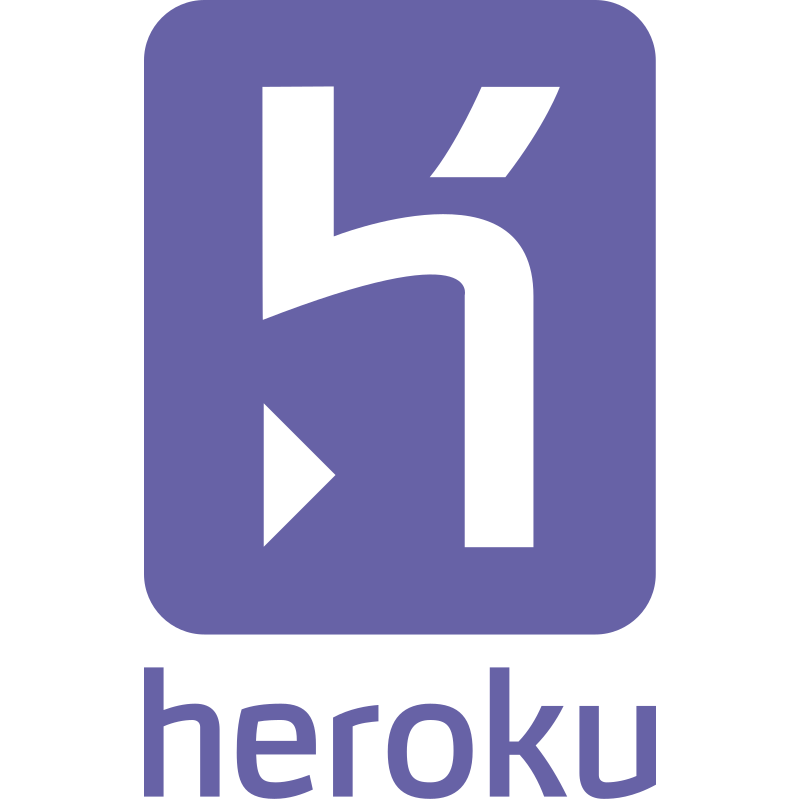

# Coder Packages

Install [Coder](https://github.com/coder/coder) to your preferred cloud with a pre-built package.

| Logo                                                                                     | Platform Name         | Status      | Documentation                                                                                    | Deploy                                                                                                                                         |
| ---------------------------------------------------------------------------------------- | --------------------- | ----------- | ------------------------------------------------------------------------------------------------ | ---------------------------------------------------------------------------------------------------------------------------------------------- |
|                | AWS EC2               | Live ✅     | [Quickstart: AWS](https://coder.com/docs/v2/latest/quickstart/aws)                               | [Deploy from AWS Marketplace](https://aws.amazon.com/marketplace/pp/prodview-5gxjyur2vc7rg?sr=0-2&ref_=beagle&applicationId=AWSMPContessa)     |
|              | Fly.io                | Live ✅     | [Blog: Run Coder on Fly.io](https://coder.com/blog/remote-developer-environments-on-fly-io)      | [Deploy Coder on FLy.io](https://coder.com/blog/remote-developer-environments-on-fly-io)                                                       |
|        | Railway.app           | Live ✅     | [Blog: Run Coder on Railway.app](https://coder.com/blog/deploy-coder-on-railway-app)             |                           |
|              | Heroku                | Live ✅     | [Docs: Deploy Coder on Heroku](./heroku/README.md)                                               |  |
|         | Render.com            | Live ✅     |                                                                                                  |  |
|                | AWS EKS               | In progress | [Docs: Coder on Kubernetes](https://coder.com/docs/v2/latest/install/kubernetes)                 | [Deploy from AWS Marketplace](https://example.com)                                                                                             |
|  | Google Compute Engine | Considering | [Guide: Google Compute Engine](https://coder.com/docs/v2/latest/platforms/google-cloud-platform) |                                                                                                                                                |
